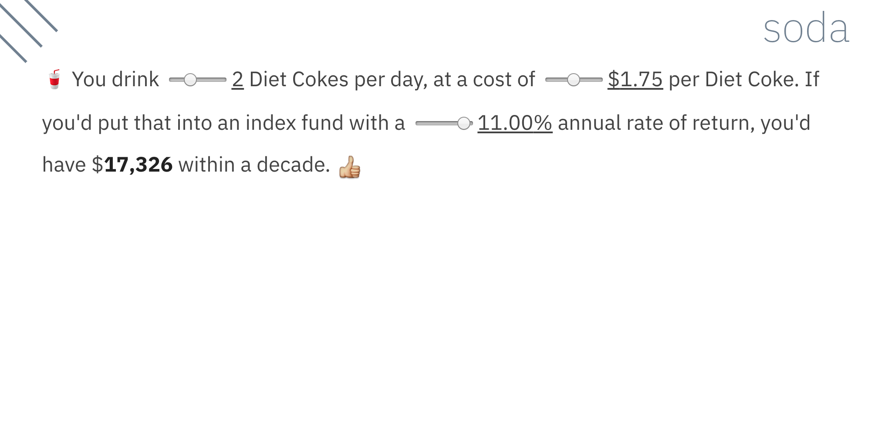

# Account: A tiny tool for accounts that account!

Account is a markup format for making web pages like this:



## What is this?


It's a tool for making short accounts, which are accounts that account for themselves using accounting.

In less annoying terms, it parses a tiny markup format and makes interactive web content with sliders. When you change a value in one slider it may change lots of other values.

My name is [Paul Ford](https://github.com/ftrain/) and I made it because I make a lot of little spreadsheets to work out how things work, and it's hard to share them and make them comprehensible. Plus it was a fun two-weekend project while we're all at home.

Now that I've made it I will return to it when 

## Why wouldn't I use Tangle/Idyll/Smalltalk-80/Excel

You should use those, they do more and are better. [Tangle](http://worrydream.com/Tangle/), [Idyll](https://idyll-lang.org/), [Smalltalk-80](https://pharo.org/), or a [spreadsheet](https://en.wikipedia.org/wiki/VisiCalc) are tools for smart people who like code, or spreadsheet people who like numbers. Account is a tool for dumb people who like moving sliders around so they can watch the numbers go, like me.

## How do I edit the text?

You don't yet, you have to pull this repository and make your own. I'm releasing early. Pull requests welcome.

## Sample text
To make the page shown in the screenshot above, you'd write:

```
:cup_with_straw: You drink
{0-4:sodas_daily} 
Diet Cokes per day, at a cost of 
${0.00-3.50:soda_cost} per Diet 
Coke.

If you'd put that into an index 
fund with a {-10.00-12.00:return}% 
annual rate of return, you'd have 
${=((((sodas_daily * 365) * soda_cost) / 12) * 
(((1 + ((return/100)/12)) ^ 120) - 1) 
/ ((return/100)/12)):total} 

within a decade. :+1:

```

Notice that newlines don't really matter. They're not real and they can't hurt you. If you want to include spacing between lines you can't. Paragraph spacing was a wasteful orthographic indulgence by lazy monks and we don't allow it here.

## What it does
* Reads a text file, and by text I mean text.
* Respects emojis between ```:``` colons like ```:+1:```.
* Respects two special bracketing formats:
   1. ```{[number or range]:[variable name]}```
   2. ```{=[expression]:[variable name]}```

So:

```{10-20:wholes} wholes is {=wholes * 2:halves} halves.```

Yields:

> ```===[-]===``` 15 wholes is *20* halves.

- (Where ```===[-]===``` is a range slider in HTML.) And when you move the slider around the numbers change. Whoo hoo!
- Numbers are just numbers, and can be negative (currently only on the lefthand-side, sorry!) or have decimal points.
- If you use a dollar sign ala ```${100:dollars}``` it will try to format things intelligently.
- It'll try to keep the number of decimal points steady, i.e. if you type ```{0.00-100.00:rating}``` it'll format the output to the hundredth after the decimal. (Most of that stuff is hacky, YMMV.)

## Under the hood

### Mathing
The thing that does the math is [expr-eval](https://github.com/silentmatt/expr-eval), which has most of the regular functions you'd expect and is pretty nice about symbols, and is both fast and reliable after trying a few alternatives.

- The math works like math.
- You need to declare variables in the order you expect them to be evaluated; i.e. you can't declare ```x``` at the bottom of your document and expect ```x``` to be available at the top.

### Parsing
The text is parsed by [parsimmon](https://github.com/jneen/parsimmon), which was fun to learn, once I gave up on regular expressions and just accepted that I could concat unmatched text after parse.

### Formatting

The numbers are formatted by [numeral.js](http://numeraljs.com/), which does what it says.

## Code Notes
This project was bootstrapped with [Create React App](https://github.com/facebook/create-react-app). It has yet to be ejected. 

## TODOs
- Some kind of routing in the interface so you can get back to pages. Right now it's just a stub.
- Some sort of array generator so that you can do sigmas via the ```fold``` inside of the ```expr-eval``` math functions. Maybe you have something like ```{#48:months}``` and that knows to generate an array from ```[n..48]``` that you can then use in sigma functions to calculate IRR or what-have-you.
- A charting module, given the above; if I know I'm over 48 months then anyting that interacts with months returns an array, I should be able to drop a chart in there.
- A way to edit in the browser and save somehow or other. Since it's just ASCII maybe it could be hacked to just save into some simple CMS. It'd be fine except for then needing to set up a password recovery module. Maybe I'll use some auth service like a young person.
- Live editing! Very simple because the parser is all JavaScript. Text on the left, live results on the right.
- Many more fun calculators made of text.
- IDK, HTML. Or citations so that we know where the math is coming from.

## Could this be used for evil?
- Yes, if people used it to "prove" things that are nonsense, like a Eugenics calculator about improving the genetic stock of humanity, or a calculator that proved that a certain percentage of humans must be turned into food.
- C.f. also "How to Lie with Statistics."
- I'll consider those risks as I do more. Since the only way to publish is to set up a whole new thingy or issue a pull request, the risk is exceedingly low.
